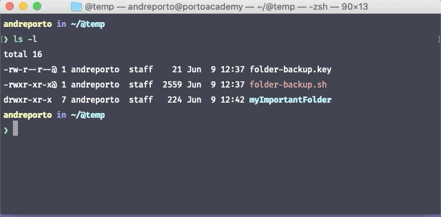

 

# Simple shell script to make encrypted folder backup 

## Installation
```shell
git clone https://github.com/andreporto/folder-backup.git

chmod +x ./folder-backup/fbkp.sh

ln ./folder-backup/fbkp.sh ~/fbkp.sh
```


## Backup:



## Restore:


## Usage

---
```shell
folder-backup.sh "SOURCE_FOLDER" ["TARGET FOLDER NAME"] ["CUSTOM PASSWORD"]
```
---
* "SOURCE_FOLDER" IS THE SOURCE FOLDER NAME TO BACKUP, IT CAN CONTAINS FILES AND SUB-FOLDERS
* IF NO TARGET FOLDER IS ENTERED IT WILL BE CREATED A SOURCE_FOLDER + DATE NAMED FOLDER
* OPTIONALLY YOU CAN ENTER A [CUSTOM PASSWORD]
* IF NO PASSWORD IS ENTERED DEFAULT PASSWORD WILL BE USED TO ENCRYPT FILES
* "REPLACE-THIS-TEXT-WITH-YOUR-REAL-PASSWORD-IN-DOUBLE-QUOTES" IS THE DEFAULT PASSWORD AND YOU CAN CHANGE IT.
---

### Examples:


- Zip all files and sub-folders from MyFolder to a new folder named with MyFolder-YYYY-MM-DD pattern. All zip files will be encrypted with with custom or default password.
```shell
~/fbkp.sh MyFolder
```
---

- Zip all files and sub-folders from MyFolder to MySafeStorage folder. All zip files will be encrypted with with custom or default password.
```shell
~/fbkp.sh MyFolder MySafeStorage
```
---

- Zip all files and sub-folders from MyFolder to MySafeStorage folder. All zip files will be encrypted with "MySecureKey123" password.
```shell
~/fbkp.sh MyFolder MySafeStorage MySecureKey123
```
---

## Contributing
Pull requests are welcome. For major changes, please open an issue first to discuss what you would like to change.

## License
[MIT](https://choosealicense.com/licenses/mit/)
